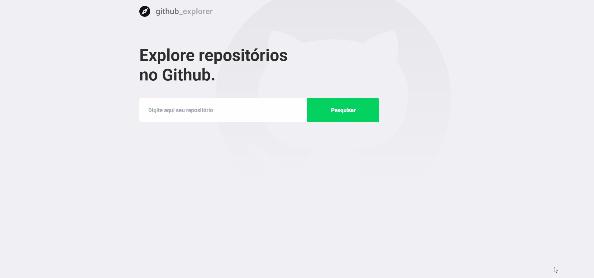

<h1 align="center"> 👉 Github Explorer 👈 </h1> 

 Aplicação desenvolvida em react/typescript para utilizar a API do github. Estilizando app com styled-componet. 

  

## 🚀 Technologies
- Javascript
- Typescript
- ReactJS
- CSS
- Styled-components
- Local storage
- HTML
